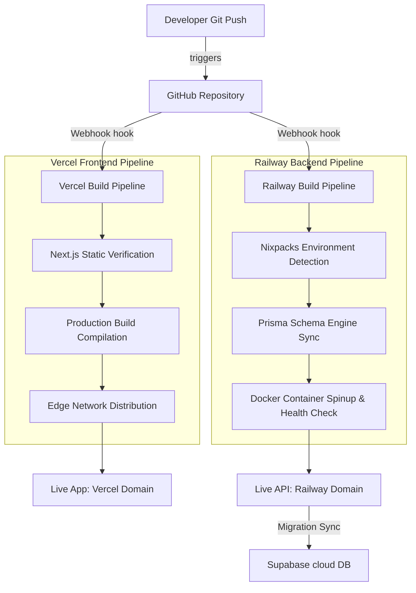

# TeamFlow – CI/CD Workflow & Deployment Pipeline

This document explains the automated **Continuous Integration and Continuous Deployment (CI/CD)** pipeline configured for the **TeamFlow** platform. Every code change pushed to the main repository triggers an automated build, validation, and deployment cycle.

---

## 🛠️ Pipeline Architecture Overview

The system uses a git-triggered deployment architecture split across two cloud providers: **Vercel** (Frontend Client hosting) and **Railway.app** (Backend REST/Socket API hosting).



---

## 🚀 1. Backend Continuous Integration & Deployment (Railway)

The API server's deployment pipeline is managed automatically by Railway upon code changes.

### A. Environment Provisioning & Build Setup
* **Nixpacks Engine**: Railway utilizes the **Nixpacks** build tool to scan the backend directory, detect a Node.js runtime, provision a lightweight production Alpine Linux environment, and install dependencies (`npm install --production`).
* **Prisma Schema Mapping**: Before starting the server, the pipeline automatically compiles the Prisma client matching the Supabase PostgreSQL structure:
  ```bash
  npx prisma generate
  ```

### B. Deployment & Container Activation
* **Deployment Trigger**: Pushing to the `main` branch triggers an automated build.
* **Port Binding**: The runtime environment binds the server to the production port (`PORT=5000`) and opens public HTTPS routing.
* **WebSocket Keep-Alive**: Railway supports persistent TCP connections, ensuring that the `Socket.io` connection pool for real-time notification dispatch remains active and connected.

---

## 💻 2. Frontend Continuous Integration & Deployment (Vercel)

The user interface client's build pipeline is optimized for edge-delivery and static page generation.

### A. Code Validation & Compilation
* **Static Generation Verification**: Vercel scans the Next.js workspace and compiles the pages. Any syntax error, broken import, or TypeScript mismatch breaks the build immediately and prevents buggy code from reaching production.
* **Minification**: Compiles and minifies CSS and Javascript bundles using the SWC compiler, optimizing page load times.

### B. Edge Networking & CDN Distribution
* Once the build completes, the compiled Next.js assets are distributed across Vercel’s global Edge network, delivering fast load times globally.

---

## 🛡️ 3. Safe Database Schema Updates (Supabase Sync)

To prevent database downtime or service disruption:
1. **Local Modifications**: Developers modify the database models inside `backend/prisma/schema.prisma` and test changes locally.
2. **Prisma Schema Push**: During production deployment, the database is safely kept in sync with the live Supabase instance using `Direct connection strings` (port 5432) to avoid locking tables or interrupting active user sessions on the pooled port (6543).

---

## 🔧 How to Trigger a Deployment Manually
If you want to trigger a rebuild manually without code changes:
* **For Frontend**: Go to your **Vercel Dashboard**, select the `team-flow-project` project, click **Deployments**, select the latest build, and click **Redeploy**.
* **For Backend**: Go to your **Railway Dashboard**, click the `backend` service block, select **Deployments**, and click **Re-deploy**.
